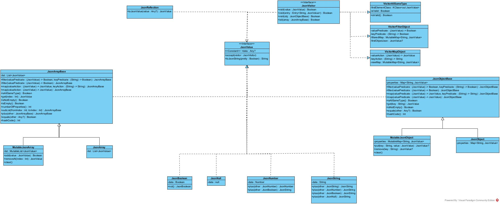
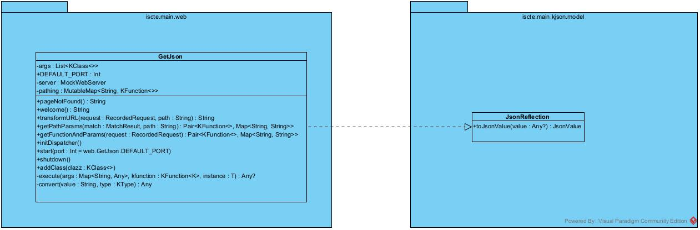

# KJSON

This Kotlin library provides in-memory JSON modeling and manipulation capabilities, allowing developers to compose and use JSON structures.

The library focuses on type-safe JSON manipulation, enabling powerful post-processing operations.

## Official Documentation Page
https://pafmoura.github.io/KJSON/

## ✅ Main Features

- Programmatically create and compose JSON structures
- Filter and transform JSON objects and arrays
- Serialize to standard JSON strings
- Convert Kotlin objects to JSON models using reflection


## 💻 Authors

<div align="center">

| [@AlexandreMilharado](https://github.com/AlexandreMilharado)  |[@pafmoura](https://github.com/pafmoura) |
|:--:|:--:|
|   |  |
</div>


## 📑 UML Digram

This diagram reflects the current model library implementation.



## 📔 Examples

This section aims to present code examples for the library's basic functionalities.
For more details, please consult the [library's official documentation](https://pafmoura.github.io/KJSON/)

### Model
Code examples related to the manipulation of JSON Model

#### Composing values

The library allows the creation and manipulation of 6 different main types of objects:
- JsonObject
    - JsonMutableObject
    - JsonObject (Immutable)
- JsonArray
    - JsonMutableArray
    - JsonArray (Immutable)
- JsonString
- JsonNumber
- JsonBoolean
- JsonNull

For detailed information, please check the [library's official documentation](https://pafmoura.github.io/KJSON/).

```kotlin
// Creating a simple JSON object
val person = JsonObject(
    mapOf(
        "name" to JsonString("John Doe"),
        "age" to JsonNumber(30),
        "isStudent" to JsonBoolean(false),
        "address" to JsonObject(
            mapOf(
                "street" to JsonString("123 Main St"),
                "city" to JsonString("Lisbon"),
                "postalCode" to JsonNumber(1000)
            )
        ),
        "courses" to JsonArray(listOf(
            JsonString("Programação Avançada"),
            JsonString("Processamento Computacional da Língua"),
            JsonString("Arquitetura e Desenvolvimento de Software")
        ))
    )
)

//In alternative, there is a varargs constructor that allows multiple values for Array and Object, instead of creating a List or a Map, respectively
val person = JsonObject(
        "name" to JsonString("John Doe"),
        "age" to JsonNumber(30),
        "isStudent" to JsonBoolean(false),
        "address" to JsonObject(
                "street" to JsonString("123 Main St"),
                "city" to JsonString("Lisbon"),
                "postalCode" to JsonNumber(1000)
            ),
        "courses" to JsonArray(
            JsonString("Programação Avançada"),
            JsonString("Processamento Computacional da Língua"),
            JsonString("Arquitetura e Desenvolvimento de Software")
        )
    )


// Creating a mutable JSON object
val mutablePerson = MutableJsonObject(
        "name" to JsonString("Jane Smith"),
        "age" to JsonNumber(25)
    
)

// Adding properties to mutable object
mutablePerson.put("isStudent", JsonBoolean(true))
mutablePerson.put("courses", JsonArray(listOf(
    JsonString("Inteligência Computacional e Otimização"),
)))
```
#### String Serialization 
The library allows string serialization using the function ``toJsonString()``

For detailed information, please check the [library's official documentation](https://pafmoura.github.io/KJSON/).

```kotlin
val product = JsonObject(
    mapOf(
        "id" to JsonNumber(101),
        "name" to JsonString("Laptop XYZ"),
        "price" to JsonNumber(999.99),
        "inStock" to JsonBoolean(true),
        "specs" to JsonObject(
            mapOf(
                "cpu" to JsonString("i7"),
                "ram" to JsonString("16GB")
            )
        )
    )
)

val jsonString = product.toJsonString()
// Result: {"id": 101, "name": "Laptop XYZ", "price": 999.99, "inStock": true, "specs": {"cpu": "i7", "ram": "16GB"}}

```
Parameter ``pretty = true`` allows identation for JsonObject
```kotlin
println(product.toJsonString(true)
/*
Result:
{
"id": 101,
"name": "Laptop XYZ", 
"price": 999.99,
 ...
*/
```


#### Filter 
Filter function contains two inputs, a ``valuePredicate`` and a ``keyPredicate``.
It is always required to have a value predicate, however, ``keyPredicate`` has the default value of ``{key -> true}``

For detailed information, please check the [library's official documentation](https://pafmoura.github.io/KJSON/).
```kotlin
   val university = JsonObject(
            mapOf(
                "name" to JsonString("ISCTE"),
                "departments" to JsonArray(
                    listOf(
                        JsonObject(
                            mapOf(
                                "name" to JsonString("Computer Science"),
                                "head" to JsonString("Prof. João Manuel")
                            )
                        ),
                        JsonObject(
                            mapOf(
                                "name" to JsonString("Mathematics"),
                                "head" to JsonString("Prof. João Silva")
                            )
                        )
                    )
                ),
                "location" to JsonString("Lisbon")
            )
        )

        val filtered = university.filter(
            valuePredicate = { value ->
                value is JsonString && value.data.toString().contains("Science")
            },
            keyPredicate = { key -> key == "name" }
        )

        //filtered -> is now a JsonObject

println(filtered.toJsonString())
// Result: {"departments": [{"name": "Computer Science"}]}
```

#### Map 
The map function allows two inputs, ``ValueAction`` and ``KeyAction``. It is always required to give a ``ValueAction``, however, the ``keyAction`` has the deault value ``{key -> key}``

For detailed information, please check the [library's official documentation](https://pafmoura.github.io/KJSON/).

```kotlin
val student = JsonObject(
    mapOf(
        "id" to JsonNumber(12345),
        "name" to JsonString("Alice"),
        "grades" to JsonArray(listOf(
            JsonNumber(18),
            JsonNumber(15),
            JsonNumber(20)
        ))
    )
)

// Transform all numbers by multiplying by 2 and prefix keys with "student_"
val transformed = student.map(
    valueAction = { value ->
        when (value) {
            is JsonNumber -> JsonNumber(value.data.toInt() * 2)
            else -> value
        }
    },
    keyAction = { key -> "student_$key" }
)

//transformed -> is now a JsonObject

println(transformed.toJsonString())
// Result: {"student_id": 24690, "student_name": "Alice", "student_grades": [36, 30, 40]}
```

#### Operations
There are several operators overriden to use with our datatypes. 

Below, there are some examples of this use. For more information about this operators, please consult the [library's official documentation](https://pafmoura.github.io/KJSON/).
```kotlin
// Numbers sum
val num1 = JsonNumber(5)
val num2 = JsonNumber(10)
val result = num1 + num2

// Numbers sum, preserves the number type (Double)
val num1pos = JsonNumber(2.0)
val num2neg = JsonNumber(-1.0)
val resultposneg = num1pos + num2neg

// String Concatenation
 val str1 = JsonString("Hello")
val str2 = JsonString("World")
val result = str1 + str2

// Array Concatenation
val jsonArray1 = JsonArray(listOf(JsonString("test"), JsonNumber(123)))
val jsonArray2 = JsonArray(listOf(JsonString("test2"), JsonNumber(456)))
val result = jsonArray1 + jsonArray2
//result = JsonArray(JsonString("test"), JsonNumber(123), JsonString("test2"), JsonNumber(456))

//Array Equals
val jsonArray1 = JsonArray(listOf(JsonString("test"), JsonNumber(123)))
val jsonArray2 = JsonArray(listOf(JsonString("test"), JsonNumber(123)))
assertTrue(jsonArray1 == jsonArray2)

//And many others
```

#### Use a Visitor 
The library has implemented the pattern Visitor, that allows the transversal of the different structures.
Based on that pattern, we implemented some Concrete Visitors, designed to specific tasks

To use them explicitly, without the wrap functions developed
```kotlin
// Instantiate the visitor
val visitor = VisitorAllSameType()

// Use accept to let the visitor traverse the JSON structure
jsonArray.accept(visitor)
```

#### Create a custom visitor
Using the logic implemented, the user is allowed to create a custom visitor, to do specific tasks.
For example:
```kotlin
class CountStringsVisitor : JsonVisitor {
    var count = 0
        private set

    override fun visit(value: JsonValue): Boolean {
        if (value is JsonString) {
            count++
        }
        return false // continue visiting
    }
}
```

This visitor, can then be used with:
```kotlin
 val visitor = CountStringsVisitor()
    val jsonArr = JsonArray(
        JsonString("Hello"),
        JsonString("World"),
        JsonString("JSON"),
        JsonNumber(2025),
        JsonObject(
            "key1" to JsonString("value1"),
            "key2" to JsonNumber(42),
            "key3" to JsonArray(
                JsonString("item1"),
                JsonString("item2")
            )
        ))
    
    jsonArr.accept(visitor)
    println("Number of strings: ${visitor.count}")
    //result: "Number of String: 6"
```

This example is available in the file ExampleTutorialVisitor.kt

### 🚪 Inference
Code examples related to the JSON Inference 

#### Transform to Json 
Through reflection, the library allows the transformation of the following Kotlin datatypes:
- Int
- Double
- Boolean
- String
- List< supported type >
- Enums
- null
- Data classes with properties whose type is supported
- Maps (Map) that associate Strings (keys) to any of the above Kotlin elements

```kotlin
   data class Course(
        val name: String,
        val credits: Int,
        val evaluation: List<EvalItem>
    )


    data class EvalItem(
        val name: String,
        val percentage: Double,
        val mandatory: Boolean,
        val type: EvalType?
    ) {

    }


    enum class EvalType {
        TEST, PROJECT, EXAM
    }

    val course = Course(
        "PA", 6, listOf(
            EvalItem("quizzes", .2, false, null),
            EvalItem("project", .8, true, EvalType.PROJECT)
        )
    )

    // transform in JsonObject
    var obj = JsonReflection.toJsonValue(course)
    
    println(obj.toJsonString())
    //result: "{"name": "PA", "credits": 6, "evaluation": [{"name": "quizzes", "percentage": 0.2, "mandatory"...


```
# GetJSON API
As a Use Case for this library, a server was created to allow the creation of HTTP/GET endpoints that return JSON. This framework uses the library in question to convert Kotlin values into JSON, based on the reflection presented above.

## UML Diagram
This diagram reflects the current model library implementation.




## ✅ Features

- Simple annotation-based endpoint configuration
- Automatic JSON serialization of:
  - Primitive types
  - Collections (List, Map, Pair)
  - Custom objects
- Path variable and query parameter support
- Multiple controller class support

### 📔 Main Functions Examples

### Start
```kotlin
val app = GetJson(Controller::class, ControllerTwo::class)
    app.start()
    //or, specify a port
    app.start(7580)
```

### Shutdown
```kotlin
val app = GetJson(Controller::class, ControllerTwo::class)
    app.start()
    app.shutdown()
```


## ✏️ Annotations
This library contains three types of annotations that allow the specification of mapping, variables and parameters.

The examples on the following annotations are based on the ExampleServer.kt file.

####  Mapping 
This annotation applies to Class and Functions, and allows the mapping specification of this entities to a specific path

```kotlin
@Mapping("api")
class Controller {
    @Mapping("ints")
    fun demo(): List<Int> = listOf(1, 2, 3)

// Call: /api/ints
```

#### Path
 This annotation applies to Value Parameters, and allows the specification of a path variable in a function parameter

```kotlin

@Mapping("utils")
class ControllerTwo {
    @Mapping("greet/{name}")
    fun greet(
        @Path name: String
    ): String = "Hello, $name!"

// Call: /utils/greet/{name}
```


#### Param
 This annotation allows the specification of a query parameter in a function parameter

```kotlin

@Mapping("utils")
class ControllerTwo {
    @Mapping("calculate/{a}/{b}")
    fun calculate(
        @Path a: Int,
        @Path b: Int,
        @Param op: String
    ): String {
        return when (op) {
            "add" -> (a + b).toString()


// Call: /utils/calculate/{a}/{b}?op={op}      
```


## 💻 Example Server

💡 The library includes a default server, that runs on port 8080, named ExampleServer, that includes two example classes with different types of functions, that include:

| Controller    | Endpoint                     | Parameters                          | Example Request                          | Response Example                          |
|---------------|------------------------------|-------------------------------------|------------------------------------------|--------------------------------------------|
| `Controller`  | `GET /api/ints`              | None                                | `http://localhost:8080/api/ints`    | `[1, 2, 3]`                                |
| `Controller`  | `GET /api/pair`              | None                                | `http://localhost:8080/api/pair`    | `{"first":"um","second":"dois"}`           |
| `Controller`  | `GET /api/path/{pathvar}`    | `@Path pathvar: String`             | `http://localhost:8080/api/path/foo`| `"foo!"`                                   |
| `Controller`  | `GET /api/args`              | `@Param n: Int`, `@Param text: Str` | `http://localhost:8080/api/args?n=2&text=hi` | `{"hi":"hihi"}`               |
| `ControllerTwo` | `GET /utils/greet/{name}`  | `@Path name: String`                | `http://localhost:8080/utils/greet/John` | `"Hello, John!"`              |
| `ControllerTwo` | `GET /utils/calculate/{a}/{b}` | `@Path a: Int`, `@Path b: Int`, `@Param op: Str` | `http://localhost:8080/utils/calculate/10/5?op=add` | `"15"` |


