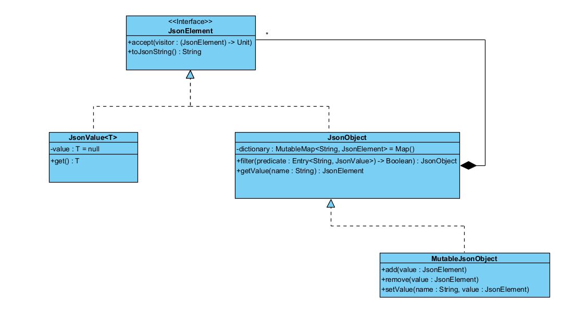

# KJSON

This Kotlin library provides in-memory JSON modeling and manipulation capabilities, allowing developers to compose and use JSON structures.

The library focuses on type-safe JSON manipulation, enabling powerful post-processing operations.

## Main Features

- Programmatically create and compose JSON structures
- Filter and transform JSON objects and arrays
- Serialize to standard JSON strings
- Convert Kotlin objects to JSON models using reflection


## Authors

- [@AlexandreMilharado](https://github.com/AlexandreMilharado)
- [@pafmoura](https://github.com/pafmoura)


## UML Digram

This diagram reflects the current library implementation (UNDER CONSTRUCTION)



## Examples

This section aims to present code examples for the library's basic functionalities.
For more details, please consult the library's official documentation

### Model
Code examples related to the manipulation of JSON Model

#### Composing values
```kotlin
Pôr código...
```
#### String Serialization 
```kotlin
Pôr código...
```


#### Filter 
```kotlin
Pôr código...
```

#### Map 
```kotlin
Pôr código...
```

#### Use Object Visitor 
```kotlin
Pôr código...
```

### Inference
Code examples related to the JSON Inference 

#### Transform to Json 
```kotlin
Pôr código...
```
# GetJSON API
As a Use Case for this library, a server was created to allow the creation of HTTP/GET endpoints that return JSON. This framework uses the library in question to convert Kotlin values into JSON, based on the reflection presented above.


